# 数字智能体核心架构与沙箱学习原理

> 本文描述 III 项目中「数字生命体」的构成，以及它在沙箱中如何感知、行动与学习。

---

## 1. 系统总览

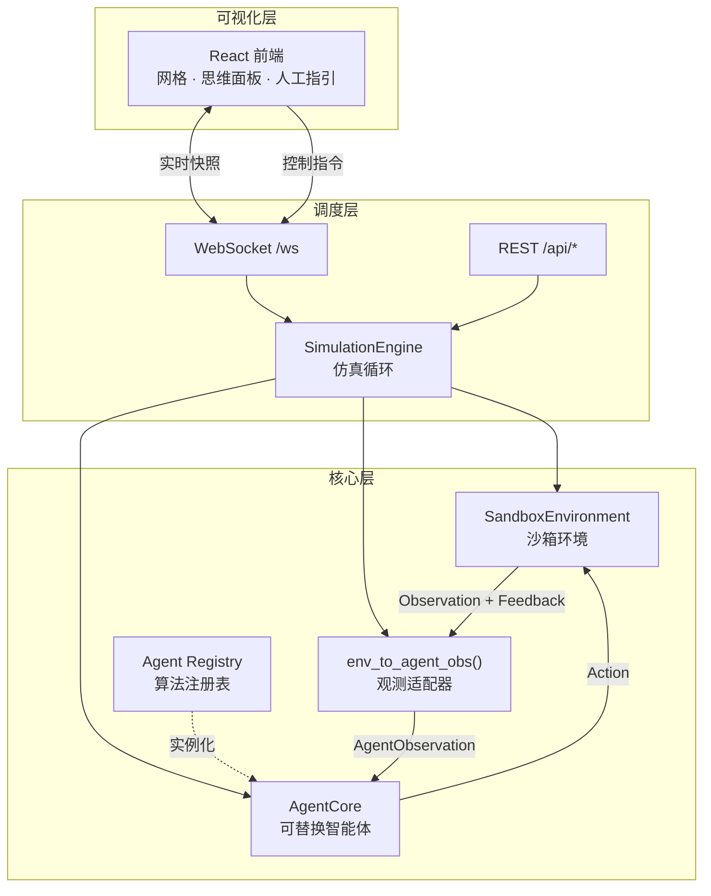

---

## 2. 数字生命体的核心构成

智能体并非单一文件，而是由**接口协议 + 适配层 + 具体算法 + 注册机制**四层组成：

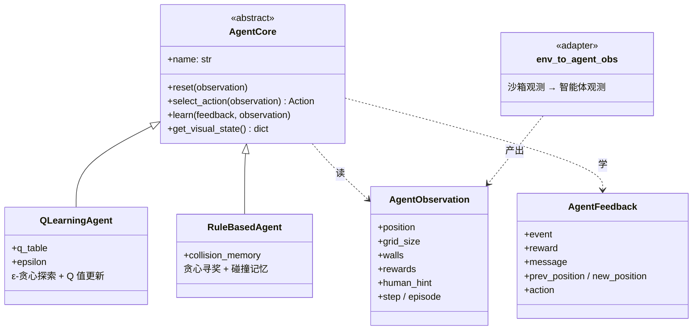

### 可替换性

```mermaid
flowchart LR
    A["继承 AgentCore"] --> B["实现四个生命周期方法"]
    B --> C["在 registry.py 注册"]
    C --> D["运行时 swap_agent() 热切换"]

    style A fill:#1a1f2e,stroke:#4ade80
    style D fill:#1a1f2e,stroke:#f0c040
```

| 方法 | 时机 | 职责 |
|------|------|------|
| `reset` | 每回合开始 | 清空/衰减回合内状态 |
| `select_action` | 每步决策 | 根据观测输出 ↑↓←→ |
| `learn` | 动作执行后 | 用反馈更新内部模型 |
| `get_visual_state` | 每帧广播 | 供前端展示「思维」 |

---

## 3. 沙箱环境构成

沙箱是智能体感知到的「外部世界」，只暴露**观测**与**反馈**，不暴露内部实现：

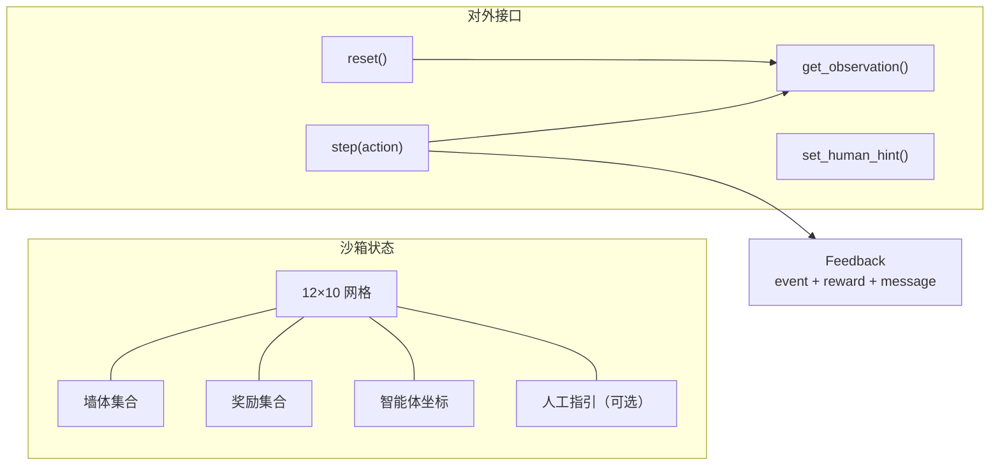

### 反馈信号（奖励塑形）

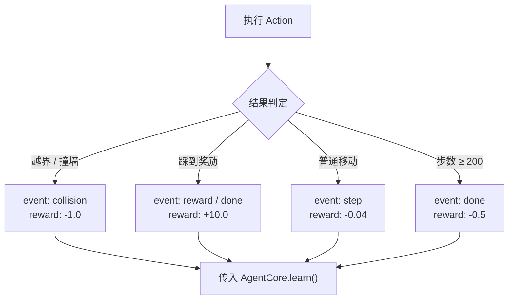

> 智能体**不直接读取地图全局最优路径**，仅通过上述稀疏反馈逐步建立行为策略。

---

## 4. 单步仿真循环（学习的最小单元）

每一 **tick** 完成一次完整的「感知 → 决策 → 行动 → 学习」闭环：

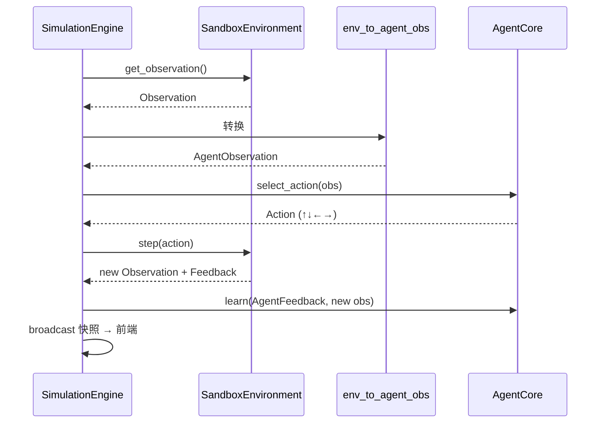

---

## 5. 回合（Episode）生命周期

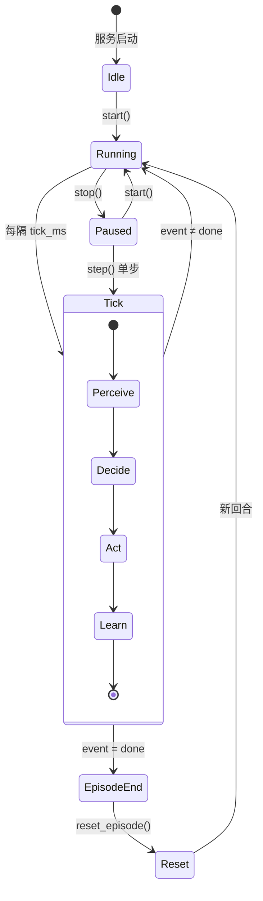

**回合结束条件：**
- 收集全部奖励
- 达到最大步数（200）

---

## 6. Q-learning 智能体的学习原理

默认智能体通过 **Q-learning** 在无任何标注轨迹的情况下学习导航：

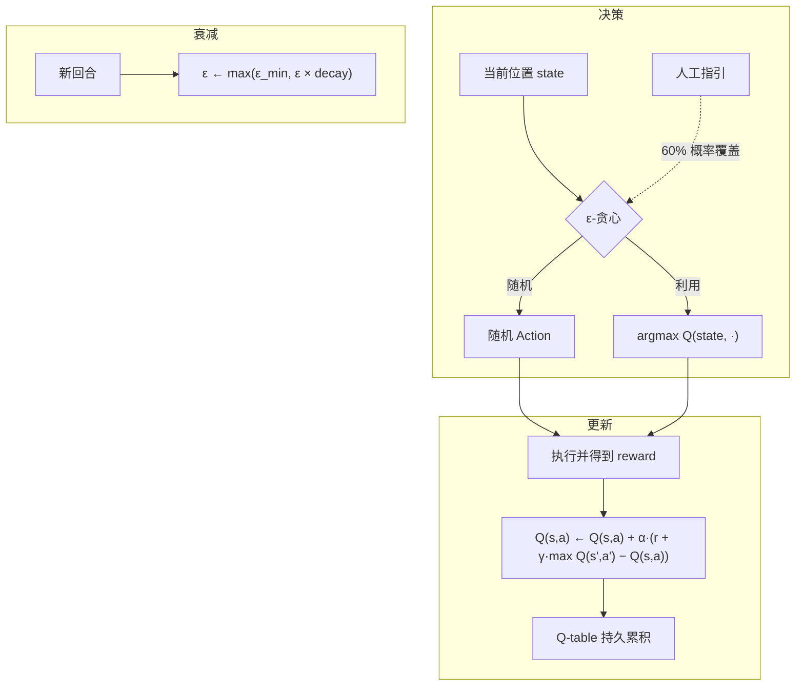

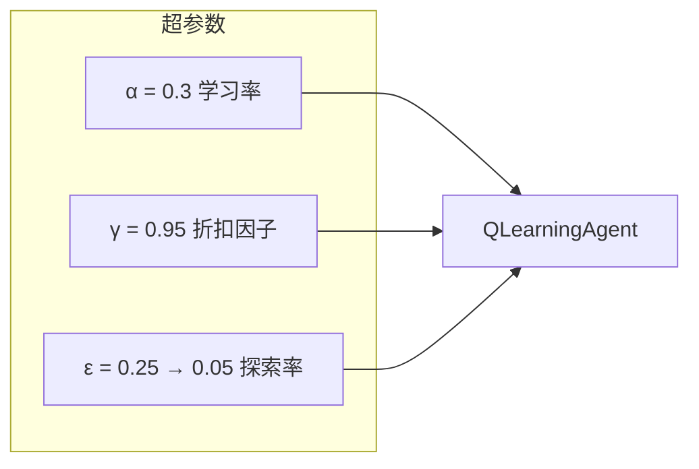

---

## 7. 弱监督：人工指引通道

人工指引不修改 Q 表，而是在**决策阶段**偏置动作选择，属于弱监督：

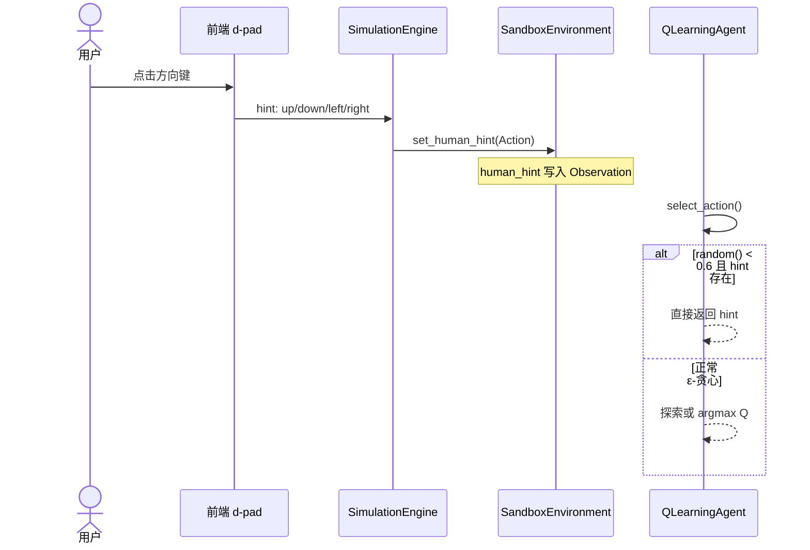

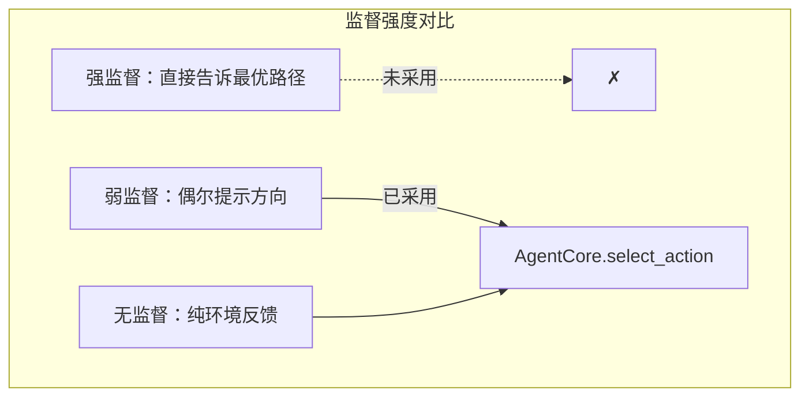

---

## 8. 数据流全景

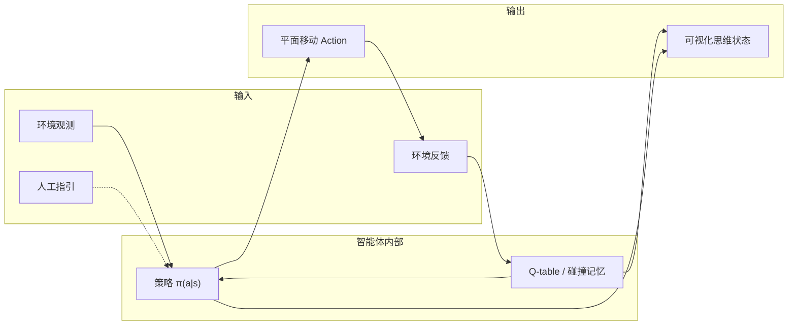

---

## 9. 目录与职责映射

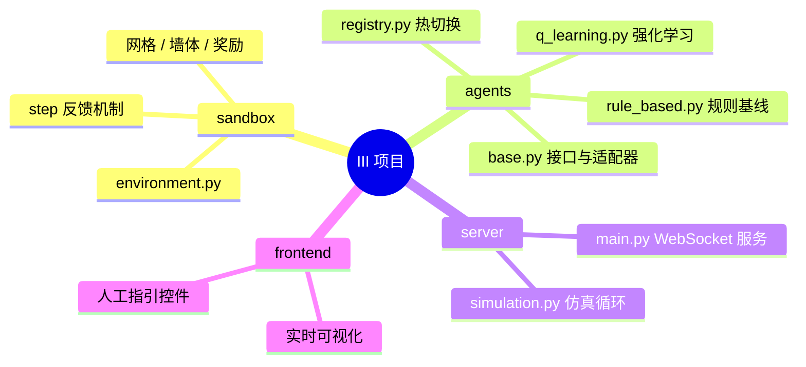

---

## 10. 扩展新智能体的路径

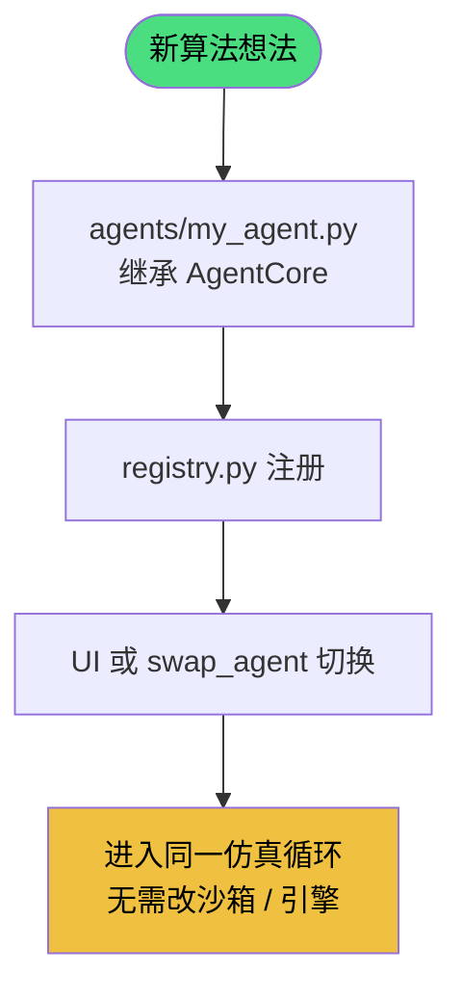

---

*文档版本：dev 分支 · 与代码同步维护*
